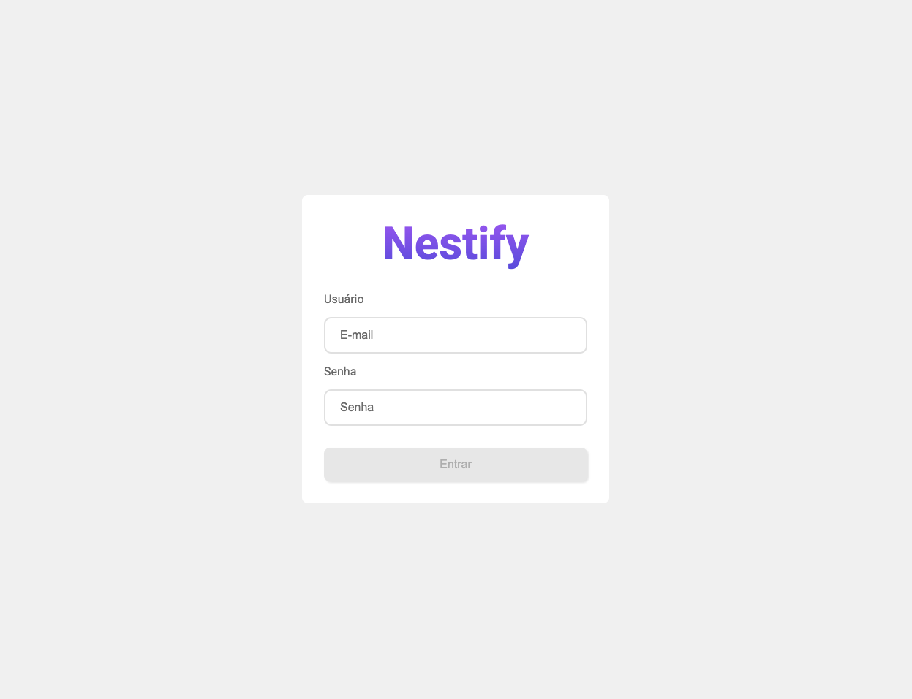

# Nestify App

Uma aplicação web para restaurantes, onde usuários autenticados podem visualizar uma lista de clientes com informações de contato. O projeto utiliza React, Firebase Authentication e Firebase Realtime Database.

<hr>



## 🚀 Tecnologias Utilizadas

- React
- Firebase Authentication
- Firebase Realtime Database
- Vite para scaffolding e build
- React Router
- Cypress para testes E2E

<hr>

## 📌 Funcionalidades

✅ Autenticação de usuários via Firebase Authentication

✅ Proteção de rotas (usuários não autenticados são redirecionados)

✅ Listagem de clientes com CNPJ, nome, telefone e e-mail utilizando Firebase Realtime Database

✅ Carregamento com indicador de progresso

<hr>


## Development 🔧

### Getting started

1. Clone esse repositorio:

```shell
$ git clone git@github.com:SabrinaBarros/Nestify.git
```

```shell
$ cd Nestify
```

2. Instale as dependencias:

```shell
$ npm install
```

3. Configure o Firebase

- Crie um projeto no Firebase Console
- Habilite Authentication (método de login: email/senha)
- Crie um Realtime Database e defina regras de leitura/escrita
- Crie um arquivo .env na raiz do projeto e adicione:

```
FIREBASE_API_KEY=
FIREBASE_AUTH_DOMAIN=
FIREBASE_DATABASE_URL=
FIREBASE_PROJECT_ID=
FIREBASE_STORAGE_BUCKET=
FIREBASE_MESSAGING_SENDER_ID=
FIREBASE_APP_ID=
```

4. Execute a aplicação:

```shell
$ npm run dev
```
Acesse em: http://localhost:5173

## 🧪 Testes

Para rodar os testes, execute:

```
$ npm run cypress:open
```

## License 📃

[MIT License](./LICENSE) © [Sabrina Barros](https://github.com/SabrinaBarros)

<hr>

Feito com ❤️ 🚀